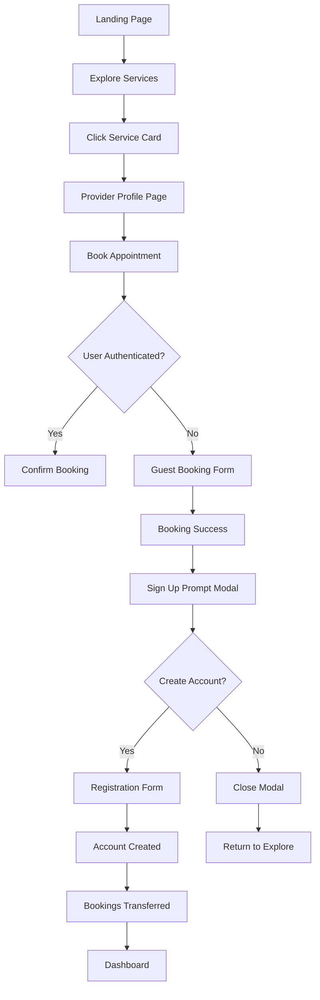

# Lazy Registration System Architecture

## Overview

The lazy registration system allows guests to browse provider profiles and services without authentication, book appointments as guests, and then optionally sign up to manage their bookings. This supports the happy path: Landing → Explore → Profile → Book → Sign Up.

## Current State Analysis

- **Backend**: Guest booking is implemented with migration 004_add_guest_booking_fields.sql
- **API**: Public endpoints exist for providers (/providers), services (/services), slots (/slots/search/available), and guest booking (/appointments/guest-book)
- **Frontend**: Explore page allows browsing services, BookAppointmentForm handles guest booking with fields for name/email/phone
- **Gaps**: No public provider profile page, no sign-up prompt after booking, no guest-to-user conversion flow

## Database Schema Changes

### Existing Guest Booking Schema

```sql
ALTER TABLE appointments
ADD COLUMN guest_name VARCHAR(255),
ADD COLUMN guest_email VARCHAR(255),
ADD COLUMN guest_phone VARCHAR(50),
ADD COLUMN is_guest_booking BOOLEAN DEFAULT FALSE;

ALTER TABLE appointments
ALTER COLUMN user_id DROP NOT NULL;

ALTER TABLE appointments
ADD CONSTRAINT check_guest_or_user
CHECK (
  (user_id IS NOT NULL AND is_guest_booking = FALSE) OR
  (user_id IS NULL AND is_guest_booking = TRUE AND guest_name IS NOT NULL AND guest_email IS NOT NULL)
);
```

### Additional Changes for Lazy Registration

1. **Guest Session Tracking**

   ```sql
   CREATE TABLE guest_sessions (
     session_id UUID PRIMARY KEY DEFAULT gen_random_uuid(),
     guest_email VARCHAR(255) NOT NULL,
     created_at TIMESTAMP DEFAULT CURRENT_TIMESTAMP,
     expires_at TIMESTAMP DEFAULT (CURRENT_TIMESTAMP + INTERVAL '30 days'),
     last_activity TIMESTAMP DEFAULT CURRENT_TIMESTAMP
   );

   CREATE INDEX idx_guest_sessions_email ON guest_sessions(guest_email);
   CREATE INDEX idx_guest_sessions_expires ON guest_sessions(expires_at);
   ```

2. **Provider Profile Views Tracking**
   ```sql
   ALTER TABLE providers
   ADD COLUMN profile_views INTEGER DEFAULT 0,
   ADD COLUMN last_profile_view TIMESTAMP;
   ```

## API Modifications

### New Endpoints

1. **GET /providers/profile/:bookingSlug** - Public provider profile with services and reviews
2. **POST /auth/convert-guest** - Convert guest booking to registered user
3. **GET /guest/appointments** - Retrieve guest appointments by email (with token verification)
4. **POST /guest/verify-email** - Send verification email for guest bookings

### Enhanced Endpoints

1. **GET /providers** - Add pagination, filtering, and sorting options
2. **GET /services** - Add provider details in response
3. **POST /appointments/guest-book** - Return booking confirmation with sign-up prompt data

## Frontend State Management

### AuthContext Enhancements

- Add `guestSession` state for tracking guest interactions
- Add `convertGuestToUser(guestEmail, userData)` method
- Add `promptSignUp(bookingData)` method for post-booking registration

### New Context: GuestContext

```javascript
const GuestContext = createContext();

export const GuestProvider = ({ children }) => {
  const [guestData, setGuestData] = useState({
    email: null,
    bookings: [],
    pendingSignUp: false
  });

  const saveGuestBooking = (booking) => {
    // Store in localStorage and context
  };

  const convertToUser = async (userData) => {
    // API call to convert guest to user
  };

  return (
    <GuestContext.Provider
      value={{
        guestData,
        saveGuestBooking,
        convertToUser
      }}
    >
      {children}
    </GuestContext.Provider>
  );
};
```

## Happy Path Implementation

### 1. Landing Page

- Hero section with "Explore Services" CTA
- Featured providers/services
- No authentication required

### 2. Explore Page (Current)

- List all services with provider info
- Search/filter functionality
- "View Profile" button for each service

### 3. Provider Profile Page (New)

- Route: `/provider/:bookingSlug`
- Provider bio, services, ratings
- Available time slots preview
- "Book Appointment" CTA

### 4. Booking Flow (Enhanced)

- Guest booking form (current implementation)
- Success message with sign-up prompt
- Option to create account immediately or later

### 5. Sign Up Flow

- Pre-fill guest data (name, email)
- Associate existing guest bookings with new account
- Redirect to dashboard with bookings

## User Experience Flow



## Technical Implementation Details

### Guest Session Management

- Use localStorage for guest email tracking
- Server-side session validation for sensitive operations
- Automatic cleanup of expired sessions

### Booking Conversion

- When user signs up with email matching guest booking
- Update appointment records to link to user_id
- Send confirmation email with account details

### Security Considerations

- Rate limiting on guest bookings
- Email verification for guest bookings
- Secure token generation for guest session management

### Performance Optimizations

- Cache provider profiles and services
- Lazy load booking forms
- Optimize database queries with proper indexing

## Migration Strategy

1. Deploy database changes
2. Add new API endpoints
3. Create provider profile page
4. Enhance booking success flow with sign-up prompts
5. Add guest context and conversion logic
6. Update routing and navigation
7. Test end-to-end flow
8. Monitor and optimize performance
