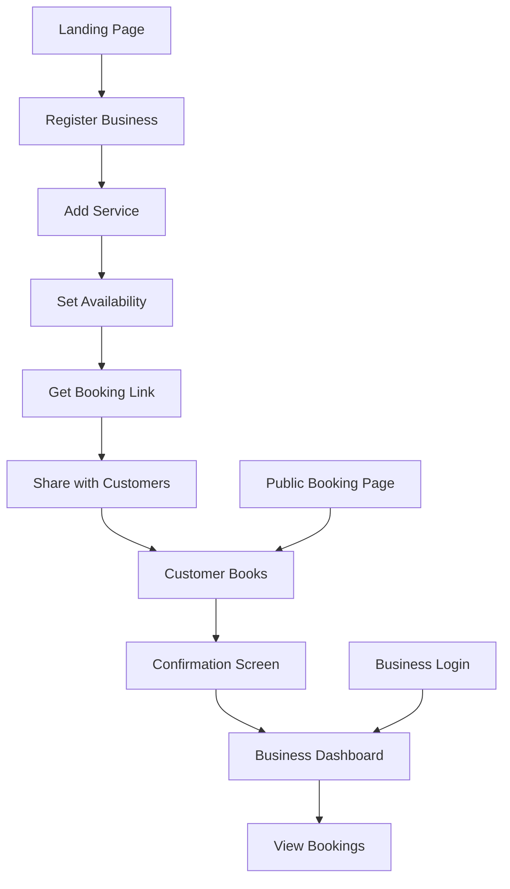

# MVP Frontend Refactor Plan

## Overview

This plan outlines the frontend changes needed to transform the appointment booking app into a streamlined MVP focused on core business onboarding and booking functionality. The refactor emphasizes simplicity, mobile-first design, and quick setup (under 10 minutes) while maintaining essential features.

## Key MVP Requirements

- Business onboarding (simplified registration)
- Add services (name, description, duration, price)
- Set availability (time slots)
- Public booking link
- Client booking without login
- Booking confirmation screen
- Business dashboard to view bookings
- Prevent double bookings
- Email/password auth only
- Simple terminology
- Mobile-first design
- Trust signals and edge-case protection

## Detailed Component Modifications

### 1. Registration Form (`Register.jsx`)

**Changes:**

- Remove `user_type` field and selection
- Change `name` field to "Business Name"
- Simplify password validation (remove complex regex, use basic length check)
- Update validation schema and form handling
- Default user role to "provider" in submission
- Update success messaging and navigation

**New Flow:**

```
Business Name → Email → Password → Create Account → Redirect to onboarding/dashboard
```

### 2. Authentication System

**Remove:**

- `GoogleButton.jsx` component
- Google OAuth routes and handlers
- `GoogleAuthContext.jsx`, `GoogleAuthDebug.jsx`
- All Google-related hooks and services

**Simplify:**

- Update `AuthContext.jsx` to handle email/password only
- Remove Google auth options from login/register pages
- Update error messages to use simple terminology

### 3. Provider Dashboard (`ProviderDashboard.jsx`)

**Current:** 4 tabs (Services, Timeslots, Profile & Links, Marketing)
**New:** 3 simplified sections

**New Structure:**

- **Services**: Add/edit services with quick form
- **Availability**: Set time slots with calendar interface
- **Bookings**: View and manage appointments

**Remove:**

- Marketing tab
- Referral code section
- Complex analytics/features

### 4. Public Booking Page (`ProviderProfile.jsx`)

**Optimizations:**

- Faster loading (lazy load non-critical content)
- Clearer CTAs ("Book Now" prominent)
- Simplified service display
- Better mobile layout
- Enhanced trust signals (verified badges, reviews, etc.)

### 5. Booking Flow (`BookAppointment.jsx`)

**Enhancements:**

- More prominent confirmation screen
- Better trust signals (business info, clear pricing)
- Improved mobile experience
- Simplified guest booking (name, email, phone)
- Clear success messaging

### 6. Appointments View (`Appointments.jsx`)

**Simplifications:**

- Focus on confirmed bookings
- Remove complex status management for MVP
- Better mobile card layout
- Clear action buttons (reschedule, cancel)

## Routing Updates

### Current Routes

```
/ (landing)
/explore
/provider/:bookingSlug (public booking)
/login
/register
/dashboard (client)
/provider/dashboard
/slots
/timeslots
/appointments
/my-appointments
/profile
/provider/profile
```

### Proposed Simplified Routes

```
/ (landing with business focus)
/provider/:bookingSlug (public booking - priority)
/register (business onboarding)
/login (simplified)
/provider/dashboard (unified dashboard)
/provider/bookings (view bookings)
/explore (optional, simplified)
```

**Remove for MVP:**

- Client-specific routes (`/dashboard`, `/my-appointments`, `/profile`)
- Complex routes (`/slots`, `/timeslots`)

## State Management Simplifications

### Remove Complex Contexts

- `AISchedulerContext.jsx` - AI features not in MVP
- `TutorialContext.jsx` - Tutorial system
- `CurrencyContext.jsx` - Single currency for MVP
- Google auth contexts

### Streamline AuthContext

- Email/password only
- Simplified user object (focus on provider data)
- Remove client/provider role switching

### Simplify GuestContext

- Focus on guest booking data
- Remove complex session management

## UI/UX Improvements

### Mobile-First Design

**Touch Targets:** Minimum 44px height for all interactive elements
**No Horizontal Scrolling:** Ensure all content fits mobile viewport
**Fast Loading:** Optimize images, lazy loading, minimal JS

### Trust Signals Implementation

- Clear business name display
- Verified badges on profiles
- Booking confirmation with details
- Phone number visibility
- Friendly, reassuring copy throughout

### Simple Terminology Updates

| Current        | New                  |
| -------------- | -------------------- |
| API/Slot       | Time                 |
| Submit         | Continue             |
| Error occurred | Something went wrong |
| Authentication | Sign in              |
| Timeslot       | Time slot            |
| Provider       | Business             |
| Client         | Customer             |

### Edge-Case Protection

- Input validation with clear error messages
- Prevent bookings outside business hours
- Handle slow network (loading states, retry options)
- Form validation prevents invalid submissions
- Clear feedback for all user actions

## Onboarding Flow (Under 10 Minutes)

### Step-by-Step Wizard

1. **Register Business** (1 min)

   - Business name, email, password
   - Instant account creation

2. **Add First Service** (2 min)

   - Service name, description, duration, price
   - Quick form with validation

3. **Set Availability** (3 min)

   - Select days/hours
   - Recurring schedule setup

4. **Get Booking Link** (1 min)
   - Copy public booking URL
   - Share with customers

### Progress Tracking

- Visual progress bar
- Clear step indicators
- Skip optional steps
- Save progress automatically

## Technical Implementation Notes

### Component Architecture

```
App.jsx (simplified routing)
├── LandingPage.jsx (business-focused)
├── Register.jsx (simplified)
├── Login.jsx (email/password only)
├── ProviderDashboard.jsx (3-section layout)
│   ├── ServiceForm.jsx
│   ├── TimeSlotForm.jsx
│   └── Appointments.jsx
└── ProviderProfile.jsx (public booking page)
    └── BookAppointment.jsx (booking flow)
```

### Performance Optimizations

- Code splitting for routes
- Image optimization (WebP, lazy loading)
- Minimize bundle size (remove unused libraries)
- Service worker for offline capability

### Accessibility Improvements

- Larger touch targets
- Clear focus indicators
- Screen reader friendly
- High contrast colors
- Simple language

## Migration Strategy

### Phase 1: Core Simplification

- Update registration and auth
- Simplify dashboard
- Update terminology

### Phase 2: UI/UX Polish

- Mobile-first responsive design
- Trust signals implementation
- Edge-case handling

### Phase 3: Onboarding Flow

- Create step-by-step wizard
- Integrate with existing components
- Test end-to-end flow

### Phase 4: Optimization

- Performance improvements
- Testing and bug fixes
- Final MVP validation

## Success Metrics

- Setup time under 10 minutes
- Mobile booking completion rate >90%
- Clear error messages for all failures
- Trust signals visible on all key pages
- No horizontal scrolling on mobile
- Touch targets meet accessibility standards

## Mermaid Diagram: User Flow



This plan provides a comprehensive roadmap for transforming the frontend into a focused MVP while maintaining code quality and user experience standards.
